<h1 name="content" align="center"><a href="">
</a> MSSQL</h1>

<p align="center">
  <a href="#-lab1"></a>
  <a href="#-lab2"></a>
  <a href="#-lab3"></a>
  <a href="#-lab4"></a> 
</p>
<h3 align="center">
  <a href="#client"></a>
  Вариант 17. Нотариальная контора.
  
Работа нотариальной конторы заключается в предоставлении клиентам комплекса юридических услуг. Каждая услуга имеет свою стоимость. Клиент (ФИО, адрес, телефон, вид деятельности) заключает с конторой сделку на предоставление некоторого набора услуг.
Информация о сделках: набор услуг, общая сумма сделки, комиссионные (доход конторы). 

Реализовать:
- Ведение прайс-листа услуг;
- Заключение сделок с клиентами,  расчет суммы сделки и комиссионных;
- Вывод постоянных клиентов и общих сумм сделок;
- Подсчет выручки конторы за заданный период.


</h3>

#  Lab1
[Назад](#content)
<h3 align="center">
  <a href="#client"></a>
  Разработать ER-модель данной предметной области: выделить сущности, их атрибуты, связи между сущностями. 
Для каждой сущности указать ее имя, атрибут (или набор атрибутов), являющийся первичным ключом, список остальных атрибутов.
Для каждого атрибута указать его тип, ограничения, может ли он быть пустым, является ли он первичным ключом.
Для каждой связи между сущностями указать: 
- тип связи (1:1, 1:M, M:N)
- обязательность

ER-модель д.б. представлена в виде ER-диаграммы (картинка)

По имеющейся ER-модели создать реляционную модель данных и отобразить ее в виде списка сущностей с их атрибутами и типами атрибутов,  для атрибутов указать, явл. ли он первичным или внешним ключом 
</h3>

#### №1. ER-модель


#### №1.1. Реляционная модель


#  Lab2
[Назад](#content)
<h3 align="center">
  <a href="#client"></a>
  В соответствии с реляционной моделью данных, разработанной в Лаб.№1, создать реляционную БД на учебном сервере БД:
  
- создать таблицы, определить первичные ключи и иные ограничения
  
- определить связи между таблицами
  
- создать диаграмму

- заполнить все таблицы адекватной информацией (не меньше 10 записей в таблицах, наличие примеров для связей типа 1:M )

</h3>

## №2. Создание таблиц
```
USE [base_var17]

DROP TABLE IF EXISTS Deal_Service;
DROP TABLE IF EXISTS Service_PriceList;
DROP TABLE IF EXISTS Deal;
DROP TABLE IF EXISTS Client;
DROP TABLE IF EXISTS Notary;
DROP TABLE IF EXISTS Services;
DROP TABLE IF EXISTS PriceList;

CREATE TABLE Client (
    id INT PRIMARY KEY IDENTITY,
    full_name NVARCHAR(100) NOT NULL,
    phone NVARCHAR(12) NULL CHECK (phone LIKE '8[0-9][0-9][0-9][0-9][0-9][0-9][0-9][0-9][0-9][0-9]'
    OR phone LIKE '+7[0-9][0-9][0-9][0-9][0-9][0-9][0-9][0-9][0-9][0-9]'),
    addres NVARCHAR(300) NULL,
    activity_type NVARCHAR(300) NULL
);


CREATE TABLE Notary (
    id INT PRIMARY KEY IDENTITY,
    full_name NVARCHAR(100) NOT NULL,
    phone NVARCHAR(12) NULL CHECK (phone LIKE '8[0-9][0-9][0-9][0-9][0-9][0-9][0-9][0-9][0-9][0-9]'
    OR phone LIKE '+7[0-9][0-9][0-9][0-9][0-9][0-9][0-9][0-9][0-9][0-9]'),
    email NVARCHAR(50) NULL CHECK (email LIKE '%@%.__%'),
    job_title NVARCHAR(100) NOT NULL
);

CREATE TABLE Deal (
    id INT PRIMARY KEY IDENTITY,
    deal_number INT NOT NULL UNIQUE,
    deal_date DATE NOT NULL DEFAULT GETDATE(),
    total_amount DECIMAL(10,2) NOT NULL CHECK (total_amount >= 0),
    commission DECIMAL(10,2) NOT NULL CHECK (commission >= 0),
    deal_status NVARCHAR(20) NOT NULL DEFAULT 'В обработке',
    client_id INT NOT NULL,
    notary_id INT NOT NULL,
    FOREIGN KEY (client_id) REFERENCES Client(id),
    FOREIGN KEY (notary_id) REFERENCES Notary(id)
);

CREATE TABLE Services (
    id INT PRIMARY KEY IDENTITY,
    service_name NVARCHAR(100) NOT NULL,
    cost DECIMAL(10,2) NOT NULL CHECK (cost >= 0),
    description NVARCHAR(300) NULL
);

CREATE TABLE PriceList (
    id INT PRIMARY KEY IDENTITY,
    pricelist_name NVARCHAR(100) NOT NULL,
    currency NVARCHAR(10) NOT NULL DEFAULT 'RUB',
    date_start DATE NOT NULL DEFAULT GETDATE(),
    date_end DATE NULL,
    comment NVARCHAR(300) NULL,
    CHECK (date_end IS NULL OR date_end >= date_start)
);


CREATE TABLE Deal_Service (
    deal_id INT NOT NULL,
    service_id INT NOT NULL,
    PRIMARY KEY (deal_id, service_id),
    FOREIGN KEY (deal_id) REFERENCES Deal(id),
    FOREIGN KEY (service_id) REFERENCES Services(id)
);


CREATE TABLE Service_PriceList (
    service_id INT NOT NULL,
    pricelist_id INT NOT NULL,
    PRIMARY KEY (service_id, pricelist_id),
    FOREIGN KEY (service_id) REFERENCES Services(id),
    FOREIGN KEY (pricelist_id) REFERENCES PriceList(id)
);

INSERT INTO Client (full_name, phone, addres, activity_type)
VALUES 
(N'Иванов Иван Иванович', '89001234567', N'Москва, ул. Ленина, д.1', N'Физическое лицо'),
(N'Петров Петр Петрович', '89002345676', N'Санкт-Петербург, Невский пр., д.10', N'Физическое лицо'),
(N'Сидорова Анна Николаевна', '89003456784', N'Казань, ул. Кремлёвская, д.5', N'ИП'),
(N'Кузнецов Алексей Павлович', '89004567893', N'Новосибирск, Красный пр., д.20', N'Юридическое лицо'),
(N'Морозова Ольга Сергеевна', '89005678903', N'Екатеринбург, ул. Мира, д.15', N'Физическое лицо'),
(N'Васильев Николай Олегович', '89006789011', N'Нижний Новгород, ул. Горького, д.12', N'ИП'),
(N'Смирнов Дмитрий Алексеевич', '89007890142', N'Ростов-на-Дону, ул. Пушкинская, д.8', N'Юридическое лицо'),
(N'Федорова Елена Викторовна', '89008901234', N'Самара, ул. Молодогвардейская, д.3', N'Физическое лицо'),
(N'Михайлов Артем Андреевич', '89009012384', N'Уфа, ул. Октября, д.11', N'Физическое лицо'),
(N'Григорьев Сергей Валентинович', '89010123452', N'Краснодар, ул. Северная, д.9', N'Юридическое лицо'),
(N'Трофимов Кирилл Олегович', '89011234567', N'Москва, пр. Вернадского, д.15', N'Физическое лицо'),
(N'Романова Алина Павловна', '89012345678', N'Санкт-Петербург, ул. Марата, д.22', N'ИП'),
(N'Гаврилов Степан Андреевич', '89013456789', N'Казань, пр. Победы, д.5', N'Юридическое лицо'),
(N'Егорова Дарья Николаевна', '89014567890', N'Новосибирск, ул. Советская, д.8', N'Физическое лицо'),
(N'Данилов Артем Викторович', '89015678901', N'Екатеринбург, ул. Куйбышева, д.12', N'ИП');

INSERT INTO Notary (full_name, phone, email, job_title)
VALUES
(N'Иванова Мария Сергеевна', '89011112226', 'ivanova@mail.ru', N'Главный нотариус'),
(N'Семенов Павел Викторович', '89011113333', 'semenov@mail.ru', N'Нотариус'),
(N'Орлова Екатерина Петровна', '89011114440', 'orlova@mail.ru', N'Нотариус'),
(N'Киселев Игорь Николаевич', '89011115555', 'kiselev@mail.ru', N'Нотариус'),
(N'Алексеева Оксана Дмитриевна', '89011116662', 'alekseeva@mail.ru', N'Нотариус'),
(N'Попов Андрей Иванович', '89011117779', 'popov@mail.ru', N'Нотариус'),
(N'Соколова Татьяна Олеговна', '89011118885', 'sokolova@mail.ru', N'Нотариус'),
(N'Захаров Владимир Степанович', '89011119997', 'zakharov@mail.ru', N'Нотариус'),
(N'Калинина Наталья Игоревна', '89011120009', 'kalinina@mail.ru', N'Нотариус'),
(N'Громов Сергей Владимирович', '89011121110', 'gromov@mail.ru', N'Нотариус');

INSERT INTO Services (service_name, cost, description)
VALUES
(N'Заверение копий документов', 500, N'Заверение копий официальных документов'),
(N'Заверение подписи', 700, N'Заверение подписи физического или юридического лица'),
(N'Составление доверенности', 1500, N'Подготовка и заверение доверенности'),
(N'Составление завещания', 2000, N'Оформление и заверение завещания'),
(N'Составление брачного договора', 2500, N'Подготовка и заверение брачного договора'),
(N'Регистрация сделок с недвижимостью', 5000, N'Юридическое сопровождение сделок с недвижимостью'),
(N'Оформление наследства', 3000, N'Консультации и заверение документов по наследству'),
(N'Заверение перевода документа', 1000, N'Проверка и заверение перевода на иностранный язык'),
(N'Заверение договора аренды', 3500, N'Оформление и заверение договора аренды'),
(N'Оформление доверенности для бизнеса', 4000, N'Подготовка доверенности для юридических лиц'),
(N'Консультация по наследству', 1200, N'Консультации без заключения сделки'),
(N'Проверка подлинности документа', 800, N'Проверка документа без оформления сделки');


INSERT INTO PriceList (pricelist_name, currency, date_start, date_end, comment)
VALUES
(N'Прайс январь 2024', 'RUB', '2024-01-01', '2024-01-31', N'Тарифы января'),
(N'Прайс февраль 2024', 'RUB', '2024-02-01', '2024-02-29', N'Тарифы февраля'),
(N'Прайс март 2024', 'RUB', '2024-03-01', '2024-03-31', N'Тарифы марта'),
(N'Прайс апрель 2024', 'RUB', '2024-04-01', '2024-04-30', N'Тарифы апреля'),
(N'Прайс май 2024', 'RUB', '2024-05-01', '2024-05-31', N'Тарифы мая'),
(N'Прайс июнь 2024', 'RUB', '2024-06-01', '2024-06-30', N'Тарифы июня'),
(N'Прайс июль 2024', 'RUB', '2024-07-01', '2024-07-31', N'Тарифы июля'),
(N'Прайс август 2024', 'RUB', '2024-08-01', '2024-08-31', N'Тарифы августа'),
(N'Прайс сентябрь 2024', 'RUB', '2024-09-01', '2024-09-30', N'Тарифы сентября'),
(N'Прайс октябрь 2024', 'RUB', '2024-10-01', '2024-10-31', N'Тарифы октября');

INSERT INTO Deal (deal_number, deal_date, total_amount, commission, deal_status, client_id, notary_id)
VALUES
(1001, '2024-01-05', 500, 50, N'Завершена', 1, 1),
(1002, '2024-01-10', 700, 70, N'Завершена', 2, 2),
(1003, '2024-02-12', 1500, 150, N'Завершена', 3, 3),
(1004, '2024-03-01', 2000, 200, N'В обработке', 4, 4),
(1005, '2024-03-15', 2500, 250, N'Завершена', 5, 5),
(1006, '2024-04-20', 5000, 500, N'Завершена', 6, 6),
(1007, '2024-05-03', 3000, 300, N'Отменена', 7, 7),
(1008, '2024-06-10', 1000, 100, N'Завершена', 8, 8),
(1009, '2024-07-08', 3500, 350, N'Завершена', 9, 9),
(1010, '2024-08-25', 4000, 400, N'В обработке', 10, 10),
(1011, '2024-09-10', 4500, 450, N'Завершена', 11, 1),
(1012, '2024-09-12', 3800, 380, N'В обработке', 12, 1),
(1013, '2024-09-15', 2500, 250, N'Завершена', 13, 2),
(1014, '2024-09-20', 4200, 420, N'Завершена', 14, 2),
(1015, '2024-09-22', 3100, 310, N'Отменена', 15, 8),
(1016, '2024-09-25', 5200, 520, N'Завершена', 11, 8),
(1017, '2024-09-27', 2950, 295, N'В обработке', 12, 4),
(1018, '2024-09-29', 6400, 640, N'Завершена', 13, 9),
(1019, '2024-09-10', 2300, 230, N'Завершена', 3, 2),
(1020, '2024-09-10', 4100, 410, N'Завершена', 4, 5),
(1021, '2024-09-12', 1900, 190, N'Отменена', 5, 1),
(1022, '2024-09-15', 2750, 275, N'Завершена', 6, 6),
(1023, '2024-09-20', 4800, 480, N'Завершена', 8, 3),
(1024, '2024-09-20', 3100, 310, N'Завершена', 9, 3),
(1025, '2024-09-22', 2900, 290, N'Завершена', 10, 4),
(1026, '2024-09-22', 1500, 150, N'Завершена', 12, 2),
(1027, '2024-09-22', 1500, 150, N'Завершена', 15, 2);

INSERT INTO Deal_Service (deal_id, service_id)
VALUES
(1, 1), (1, 2), (1,4),
(2, 3),
(3, 4),
(4, 5), (4, 6),
(5, 7),
(6, 8), (6, 9),
(7, 10),
(8, 1),
(9, 2), (9, 3),
(10, 4), (10, 5),
(11, 1), (11, 2),
(12, 3),
(13, 4),
(14, 5), (14, 6),
(16, 8),
(17, 9),
(18, 10),
(19, 1), (19, 2),
(20, 3),
(22, 4), (22, 5),
(23, 6),
(24, 7),
(25, 8);

INSERT INTO Service_PriceList (service_id, pricelist_id)
VALUES
(1,1),(2,1),(3,1),(4,1),(5,1),(6,1),(7,1),(8,1),(9,1),(10,1),
(1,2),(2,2),(3,2),(4,2),(5,2),(6,2),(7,2),(8,2),(9,2),(10,2),
(1,3),(2,3),(3,3),(4,3),(5,3),(6,3),(7,3),(8,3),(9,3),(10,3),
(1,4),(2,4),(3,4),(4,4),(5,4),(6,4),(7,4),(8,4),(9,4),(10,4),(12,4),
(1,5),(2,5),(3,5),(4,5),(5,5),(6,5),(7,5),(8,5),(9,5),(10,5);


SELECT * FROM Client
SELECT * FROM Notary
SELECT * FROM Services
SELECT * FROM PriceList
SELECT * FROM Deal
SELECT * FROM Deal_Service
SELECT * FROM Service_PriceList


```
## №2.1. Диаграмма


## №2.2. Заполненные таблицы


#  Lab3
[Назад](#content)
<h3 align="center">
  <a href="#client"></a>
</h3>

<div>
  <h4>Часть 1</h4>
  <p><b>Цель:</b> изучить конструкции языка SQL для манипулирования данными в СУБД MSSQL.</p>
  <p><b>Задания и краткое описание работы:</b></p>
  <ol>
    <li>Выборка из одной таблицы.
      <ol type="1">
        <li>Выбрать из произвольной таблицы данные и отсортировать их по двум произвольным имеющимся в таблице признакам (разные направления сортировки).</li>
        <li>Выбрать из произвольной таблицы те записи, которые удовлетворяют условию отбора (where). Привести 2-3 запроса.</li>
        <li>Привести примеры 2-3 запросов с использованием агрегатных функций (count, max, sum и др.) с группировкой и без группировки.</li>
        <li>Привести примеры подведения подытога с использованием GROUP BY [ALL] [CUBE | ROLLUP] (2-3 запроса). В ROLLUP и CUBE использовать не менее 2-х столбцов.</li>
        <li>Выбрать из таблиц информацию об объектах, в названиях которых нет заданной последовательности букв (LIKE).</li>
      </ol>
    </li>
    <li>Выборка из нескольких таблиц.
      <ol type="1">
        <li>Вывести информацию подчиненной (дочерней) таблицы, заменяя коды (значения внешних ключей) соответствующими символьными значениями из родительских таблиц. Привести 2-3 запроса с использованием классического подхода соединения таблиц (where).</li>
        <li>Реализовать запросы пункта 2.1 через внутреннее соединение inner join.</li>
        <li>Левое внешнее соединение left join. Привести 2-3 запроса.</li>
        <li>Правое внешнее соединение right join. Привести 2-3 запроса.</li>
        <li>Привести примеры 2-3 запросов с использованием агрегатных функций и группировки.</li>
        <li>Привести примеры 2-3 запросов с использованием группировки и условия отбора групп (Having).</li>
        <li>Привести примеры 3-4 вложенных (соотнесенных, с использованием IN, EXISTS) запросов.</li>
      </ol>
    </li>
    <li>Представления
      <ol type="1">
        <li>На основе любых запросов из п. 2 создать два представления (VIEW).</li>
        <li>Привести примеры использования общетабличных выражений (CTE) (2-3 запроса).</li>
      </ol>
    </li>
    <li>Функции ранжирования
      <ol type="1">
        <li>Привести примеры 3-4 запросов с использованием ROW_NUMBER, RANK, DENSE_RANK (с PARTITION BY и без).</li>
      </ol>
    </li>
    <li>Объединение, пересечение, разность
      <ol type="1">
        <li>Привести примеры 3-4 запросов с использованием UNION / UNION ALL, EXCEPT, INTERSECT. Данные в одном из запросов отсортируйте по произвольному признаку.</li>
      </ol>
    </li>
    <li>Использование CASE, PIVOT и UNPIVOT
      <ol type="1">
        <li>Привести примеры получения сводных (итоговых) таблиц с использованием CASE.</li>
        <li>Привести примеры получения сводных (итоговых) таблиц с использованием PIVOT и UNPIVOT.</li>
      </ol>
    </li>
  </ol>

  <p><b>Обязательными к выполнению</b> являются запросы, приведенные ниже (смотри свой вариант).</p>
  <p>Отчет по лабораторной работе предоставляется в виде документа <i>(Фамилия_Группа.docx)</i>.  
  В этом документе по каждому заданию необходимо представить: условие запроса, текст SQL-запроса, скрин-копию результата выполнения запроса.</p>

  <h4>Часть 2</h4>
  <p><b>Составить следующие запросы:</b></p>
  <ol type="a">
    <li>Найти клиентов, пользовавшихся услугами конторы 2 и более раз.</li>
    <li>Найти клиентов, заключавших сделки на наибольшую сумму.</li>
    <li>Посчитать среднее количество сделок, заключаемых за день.</li>
    <li>Выдать список услуг, никогда не использовавшихся клиентами.</li>
    <li>Выдать список наиболее популярных услуг (участвующих в сделках максимальное кол-во раз).</li>
  </ol>
</div>
<a href="https://github.com/IvanMerzun/databases_Merzun_PMI-32_17v/raw/main/doc/Мерзун_ПМИ32БО.docx" target="_blank">Лабораторная №3</a>

#  Lab4
[Назад](#content)
<h3 align="center">
  <a href="#client"></a>
</h3>
<div>
  <h4>Создать  4 различных хранимых процедуры:</h4>
  <ol type="a">
    <li><b>Процедура без параметров, формирующая список услуг, не пользующихся спросом (не входят ни в одну сделку) </li>
<pre><code>
GO
CREATE PROCEDURE UnusedServices
AS
BEGIN
    SET NOCOUNT ON;

    SELECT s.id,
           s.service_name,
           s.cost,
           s.description
    FROM Services s
    LEFT JOIN Deal_Service ds ON s.id = ds.service_id
    WHERE ds.service_id IS NULL;  
END
GO

EXECUTE UnusedServices;
</code></pre>
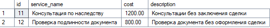

<li><b>Процедура, на входе получающая ФИО клиента и формирующая список услуг, которые выбирал клиент во всех своих сделках в виде: название услуги, сколько раз была выбрана </li>
<pre><code>
GO
CREATE PROCEDURE ClientServicesStats
    @full_name NVARCHAR(200) 

AS
BEGIN
    SET NOCOUNT ON;

    SELECT 
        s.service_name,
        COUNT(*) AS times_selected
    FROM Client c
    JOIN Deal d ON d.client_id = c.id
    JOIN Deal_Service ds ON ds.deal_id = d.id
    JOIN Services s ON s.id = ds.service_id
    WHERE c.full_name = @full_name
    GROUP BY s.service_name;


END
GO

EXECUTE ClientServicesStats @full_name = N'Кузнецов Алексей Павлович';
</code></pre>
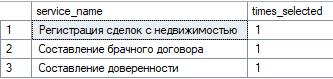

<li><b>Процедура, на входе получающая название услуги, выходной параметр – количество клиентов, которые ее выбирали </li>
<pre><code>
GO

CREATE PROCEDURE CountClientsByService
    @ServiceName NVARCHAR(100)
AS
BEGIN
    SET NOCOUNT ON;

    SELECT COUNT(DISTINCT d.client_id) as CountClient
    FROM Services s
    JOIN Deal_Service ds ON s.id = ds.service_id
    JOIN Deal d ON ds.deal_id = d.id
    WHERE s.service_name = @ServiceName;
END
GO

EXECUTE CountClientsByService N'Составление доверенности';
</code></pre>
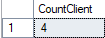


<li><b>Процедура, вызывающая вложенную процедуру, которая подсчитыват среднюю востребованность услуг. Главная процедура выводит список услуг, которые имеют востребованность меньше среднего (в т.ч. и те, которые вообще не востребованы)
 </li>
<pre><code>
GO

CREATE PROCEDURE GetAverageDemand
    @AvgDemand FLOAT OUTPUT
AS
BEGIN
    SET NOCOUNT ON;

    SELECT @AvgDemand = AVG(Demand * 1.0)
    FROM (
        SELECT s.id, COUNT(ds.service_id) AS Demand
        FROM Services s
        LEFT JOIN Deal_Service ds ON s.id = ds.service_id
        GROUP BY s.id
    ) AS T;
END
GO

-- Главная процедура: выводит услуги с востребованностью ниже среднего
IF OBJECT_ID('ListBelowAverageServices', 'P') IS NOT NULL
    DROP PROCEDURE ListBelowAverageServices;
GO

CREATE PROCEDURE ListBelowAverageServices
AS
BEGIN
    SET NOCOUNT ON;

    DECLARE @Avg FLOAT;

    EXEC GetAverageDemand @AvgDemand = @Avg OUTPUT;

    SELECT 
        s.id,
        s.service_name,
        COUNT(ds.service_id) AS Demand,
        @Avg AS AverageDemand
    FROM Services s
    LEFT JOIN Deal_Service ds ON s.id = ds.service_id
    GROUP BY s.id, s.service_name
    HAVING COUNT(ds.service_id) < @Avg
    ORDER BY s.id;
END
GO

EXEC ListBelowAverageServices;
</code></pre>
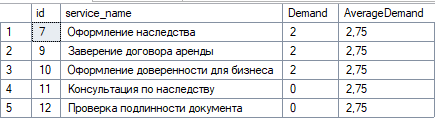
 </ol>
 <h4>Создать  3 функции:</h4>
  <ol type="a">
    <li><b>Скалярная функция, подсчитывающая выручку конторы за заданный период</li>
<pre><code>
GO

CREATE FUNCTION GetRevenue
(
    @StartDate DATE,
    @EndDate DATE
)
RETURNS DECIMAL(18,2)
AS
BEGIN
    DECLARE @Revenue DECIMAL(18,2);

    SELECT @Revenue = ISNULL(SUM(total_amount), 0)
    FROM Deal
    WHERE deal_date BETWEEN @StartDate AND @EndDate
      AND deal_status = N'Завершена';

    RETURN @Revenue;
END
GO

SELECT dbo.GetRevenue('2024-01-01', '2024-09-30') AS Revenue;

</code></pre>
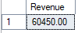


<li><b>Inline-функция, возвращающая для заданной услуги список клиентов, пользовавшихся ей, упорядоченный по убыванию количества использования</li>
<pre><code>
GO

CREATE FUNCTION ClientsByService(@ServiceName NVARCHAR(100))
RETURNS TABLE
AS
RETURN
(
    SELECT TOP 100 PERCENT
        c.full_name,
        COUNT(*) AS times_used
    FROM Client c
    JOIN Deal d ON d.client_id = c.id
    JOIN Deal_Service ds ON ds.deal_id = d.id
    JOIN Services s ON s.id = ds.service_id
    WHERE s.service_name = @ServiceName
    GROUP BY c.full_name
    ORDER BY times_used DESC
);
GO

SELECT * FROM ClientsByService(N'Составление доверенности');

</code></pre>
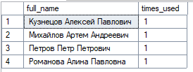


<li><b>Multi-statement-функция, выдающая список самых «дорогих» клиентов (с максимальной суммой сделок)</li>
<pre><code>
GO

CREATE FUNCTION dbo.TopClients()
RETURNS @Result TABLE
(
    client_id INT,
    full_name NVARCHAR(100),
    total_amount DECIMAL(18,2)
)
AS
BEGIN
    INSERT INTO @Result (client_id, full_name, total_amount)
    SELECT 
        c.id,
        c.full_name,
        SUM(d.total_amount) AS total_amount
    FROM Client c
    JOIN Deal d ON d.client_id = c.id
    GROUP BY c.id, c.full_name;

    DELETE FROM @Result
    WHERE total_amount < (SELECT MAX(total_amount) FROM @Result);

    RETURN;
END
GO

SELECT * FROM dbo.TopClients();

</code></pre>
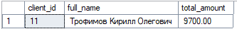

</ol>


 </ol>
 <h4>Создать  3 триггера:</h4>
  <ol type="a">
    <li><b>Триггер любого типа на добавление новой услуги в прайс – если услуга с таким названием уже есть, то она не добавляется
</li>
<pre><code>
GO

CREATE TRIGGER trg_NoDuplicateServiceInPriceList
ON Service_PriceList
INSTEAD OF INSERT
AS
BEGIN
    SET NOCOUNT ON;

    INSERT INTO Service_PriceList (service_id, pricelist_id)
    SELECT i.service_id, i.pricelist_id
    FROM inserted i
    WHERE NOT EXISTS (
        SELECT 1
        FROM Service_PriceList sp
        WHERE sp.service_id = i.service_id
          AND sp.pricelist_id = i.pricelist_id
    );
END
GO


INSERT INTO Service_PriceList (service_id, pricelist_id)
VALUES (11, 5), (12,5);

INSERT INTO Service_PriceList (service_id, pricelist_id)
VALUES (11, 5);

INSERT INTO Service_PriceList (service_id, pricelist_id)
VALUES (12, 5);

SELECT * FROM Service_PriceList

</code></pre>
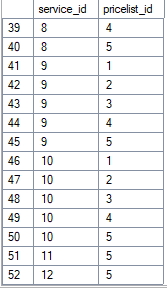


<li><b>Последующий триггер на изменение общей суммы сделки – если она становится меньше суммы цен услуг, входящих в сделку, то общая сумма заменяется на сумму цен услуг
</li>
<pre><code>
GO

CREATE TRIGGER trg_UpdateDealTotal
ON Deal
AFTER UPDATE
AS
BEGIN
    SET NOCOUNT ON;

    ;WITH Sums AS (
        SELECT 
            ds.deal_id,
            SUM(s.cost) AS sum_services
        FROM Deal_Service ds
        JOIN Services s ON s.id = ds.service_id
        GROUP BY ds.deal_id
    ),
    NeedUpdate AS (
        SELECT 
            i.id AS deal_id,
            s.sum_services
        FROM inserted i
        JOIN Sums s ON s.deal_id = i.id
        WHERE i.total_amount < s.sum_services
    )
    UPDATE Deal
    SET total_amount = NU.sum_services
    FROM NeedUpdate NU
    WHERE Deal.id = NU.deal_id;
END;
GO

SELECT d.id, s.cost
FROM Deal d
JOIN Deal_Service ds ON d.id = ds.deal_id
JOIN Services s ON s.id = ds.service_id
WHERE d.id = 1;


UPDATE Deal
SET total_amount = 100
WHERE id = 1;

SELECT id, total_amount FROM Deal WHERE id = 1;


UPDATE Deal
SET total_amount = 10000
WHERE id = 1;

SELECT id, total_amount FROM Deal WHERE id = 1;

</code></pre>
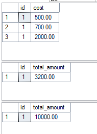


<li><b>Замещающий триггер на операцию удаления услуги из прайса – если эта услуга входит хотя бы в одну сделку – удаление не производится, выводится соотв.сообщение
</li>
<pre><code>
GO

CREATE TRIGGER trg_PreventServiceDelete
ON Service_PriceList
INSTEAD OF DELETE
AS
BEGIN
    DECLARE @service_id INT,
            @pricelist_id INT;

    DECLARE del_cursor CURSOR FOR
        SELECT service_id, pricelist_id
        FROM DELETED;

    OPEN del_cursor;
    FETCH NEXT FROM del_cursor INTO @service_id, @pricelist_id;

    WHILE @@FETCH_STATUS = 0
    BEGIN
        IF EXISTS (SELECT 1 FROM Deal_Service WHERE service_id = @service_id)
        BEGIN
            PRINT 'Услуга с ID = ' + CAST(@service_id AS NVARCHAR(10)) +
                  ' из прайс-листа с ID = ' + CAST(@pricelist_id AS NVARCHAR(10)) +
                  ' используется в сделках. Удаление невозможно.';
        END
        ELSE
        BEGIN
            DELETE FROM Service_PriceList
            WHERE service_id = @service_id
              AND pricelist_id = @pricelist_id;
        END

        FETCH NEXT FROM del_cursor INTO @service_id, @pricelist_id;
    END

    CLOSE del_cursor;
    DEALLOCATE del_cursor;
END
GO

DELETE FROM Service_PriceList
WHERE (service_id = 1 AND pricelist_id = 1)
   OR (service_id = 12 AND pricelist_id = 4)
   OR (service_id = 5 AND pricelist_id = 1);


SELECT * FROM Service_PriceList

</code></pre>
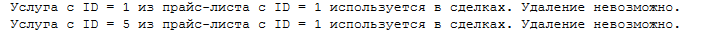
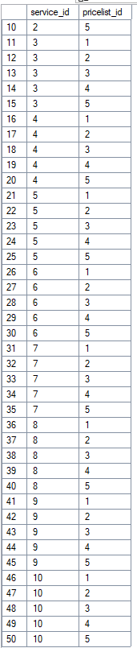


</ol>
</div>
